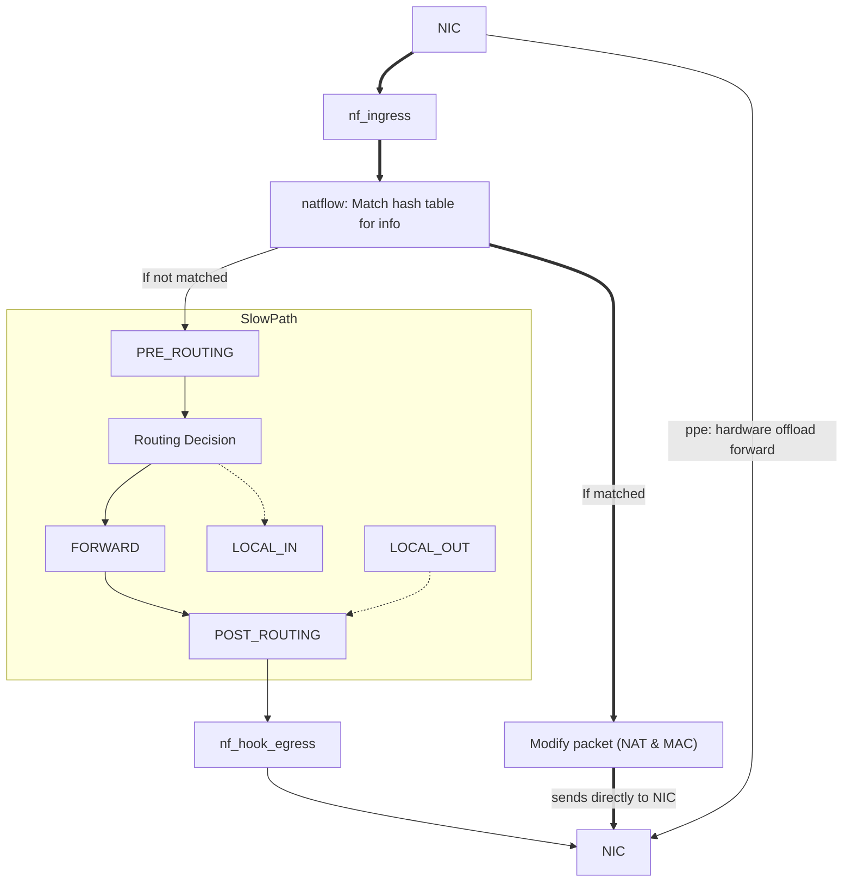

# NATflow

NATflow works by matching packets against a hash table to quickly determine forwarding information, performing necessary NAT and MAC modifications, and directly sending matched packets to the NIC, while unmatched packets follow the traditional slow path for processing.

NATflow 是一个 Linux 内核模块，用 Netfilter、conntrack、NAT、ipset、字符设备和可选硬件 NAT/WED offload 实现路由/NAT 快速转发、用户认证、QoS、URL/SNI 记录和主机访问控制。

## Graph

Fast Path with natflow:



## Documentation

- [README.md](README.md): human-oriented user manual and external interface reference.
- [SYSTEM_DESIGN_SPEC.md](SYSTEM_DESIGN_SPEC.md): implementation-oriented system design, internal state, constraints, and compatibility notes.

## Notes

**natflow** is a versatile and high-performance network acceleration solution that provides the following key features:

1. **Fastpath for High-Speed Packet Forwarding**
   - Implements a software-based fast path for rapid packet forwarding.
   - Works on any platform, delivering exceptional forwarding performance.
2. **Hardware NAT (hwnat) Support**
   - For specific platforms like **MT7621**, **MT7622**, **MT7981**, **MT7986**, and others, **natflow** provides hardware NAT support, enabling hardware-based acceleration for even higher performance.
   - Requires kernel patches for proper integration.
3. **User Identification and Traffic Auditing**
   - Identifies individual IP users and monitors their traffic and speed.
   - Provides detailed traffic auditing for user-level insights.
4. **Traffic Control (QoS)**
   - Enables bandwidth management and traffic shaping for users.
   - Ensures fair usage and optimized network performance.
5. **Internet Access Control**
   - Allows or blocks internet access for specific users based on policies.
6. **URL Auditing (urllogger)**
   - Monitors and logs the domains or URLs accessed by users.
   - Offers visibility into user browsing behavior.
7. **Website Access Control**
   - Matches user traffic against defined rules to restrict access to specific websites.

**natflow** combines software fast path, hardware acceleration on supported platforms, and advanced user management and auditing features, making it suitable for performance-critical and policy-driven network environments.

## Natflow Hardware Acceleration Overview

### Hardware Acceleration Support on X-WRT

**Natflow** supports hardware acceleration on [X-WRT](https://github.com/x-wrt/x-wrt), providing high-performance NAT and packet forwarding capabilities.

### Supported Platforms

Hardware NAT (Hwnat) support:

- Platforms: **MT7621**, **MT7622**, **MT7981**, **MT7986**
- Enables efficient hardware-based NAT forwarding.

Hwnat with WED support:

- Platforms: **MT7622**, **MT7981**, **MT7986**
- Combines hardware NAT acceleration with WED (Wireless Ethernet Dispatch) support to optimize both WiFi and wired traffic.

### Supported Forwarding Paths

Port-to-port Hwnat forwarding:

- `Port --> PPE --> Port`
- `Port <-- PPE <-- Port`

WiFi-to-port Hwnat forwarding:

- `WiFi --> CPU --> PPE --> Port`
- `WiFi <-- CPU <-- PPE <-- Port`

WiFi-to-port Hwnat forwarding with WED support:

- `WiFi --> CPU --> PPE --> Port`
- `WiFi <-- PPE <-- Port`

## 使用手册与对外接口说明

本节面向部署和对接人员。更完整的内部实现、数据结构、状态位和兼容性限制见 [SYSTEM_DESIGN_SPEC.md](SYSTEM_DESIGN_SPEC.md)。

## 构建与安装

常用构建：

```sh
make EXTRA_CFLAGS="-DCONFIG_NATFLOW_PATH -DCONFIG_NATFLOW_URLLOGGER"
```

只构建基础控制面时可以直接：

```sh
make
```

常用编译宏：

| 宏 | 作用 |
| --- | --- |
| `CONFIG_NATFLOW_PATH` | 启用 fast path、vline/relay、硬件 offload 相关控制。 |
| `CONFIG_NATFLOW_URLLOGGER` | 启用 URL logger、Host ACL 和 `/proc/sys/urllogger_store`。 |
| `CONFIG_HWNAT_EXTDEV_USE_VLAN_HASH` | MTK 外部设备硬件 offload 使用 VLAN hash 模式；会影响 bridge VLAN filter。 |
| `CONFIG_HWNAT_EXTDEV_DISABLED` | 禁用部分外部设备硬件 offload 分支。 |
| `NO_DEBUG=1` | 追加 `-DNO_DEBUG -Os`，编译期关闭日志宏。 |

示例：

```sh
make NO_DEBUG=1 EXTRA_CFLAGS="-DCONFIG_NATFLOW_PATH -DCONFIG_NATFLOW_URLLOGGER"
```

为非当前运行内核构建时，主 `Makefile` 使用 `KERNELRELEASE` 选择内核目录：

```sh
make KERNELRELEASE=6.6.1 EXTRA_CFLAGS="-DCONFIG_NATFLOW_PATH -DCONFIG_NATFLOW_URLLOGGER"
```

DKMS 入口：

```sh
make -f Makefile.dkms install
make -f Makefile.dkms uninstall
```

加载模块后，设备节点通常由内核 device/class 机制创建；如果系统没有自动创建设备节点，请根据 `dmesg` 中打印的 major/minor 手动处理。

## Warning

Since `kernel < 4.10` cannot handle `NF_STOLEN` in ingress hook correctly, a kernel patch is needed:

```diff
diff --git a/include/linux/netfilter_ingress.h b/include/linux/netfilter_ingress.h
index 5fcd375ef175..b407128a35c0 100644
--- a/include/linux/netfilter_ingress.h
+++ b/include/linux/netfilter_ingress.h
@@ -17,11 +17,15 @@ static inline bool nf_hook_ingress_active(const struct sk_buff *skb)
 static inline int nf_hook_ingress(struct sk_buff *skb)
 {
        struct nf_hook_state state;
+       int ret;
 
        nf_hook_state_init(&state, &skb->dev->nf_hooks_ingress,
                           NF_NETDEV_INGRESS, INT_MIN, NFPROTO_NETDEV,
                           skb->dev, NULL, NULL, dev_net(skb->dev), NULL);
-       return nf_hook_slow(skb, &state);
+       ret = nf_hook_slow(skb, &state);
+       if (ret == 0)
+               return -1;
+       return ret;
 }
 
 static inline void nf_hook_ingress_init(struct net_device *dev)
diff --git a/net/netfilter/core.c b/net/netfilter/core.c
index f39276d1c2d7..905597547b08 100644
--- a/net/netfilter/core.c
+++ b/net/netfilter/core.c
@@ -320,6 +320,8 @@ next_hook:
                                goto next_hook;
                        kfree_skb(skb);
                }
+       } else if (verdict == NF_STOLEN) {
+               ret = 0;
        }
        rcu_read_unlock();
        return ret;
```

## 快速启动

典型流程：

```sh
# 1. 加载模块后查看主控制面
cat /dev/natflow_ctl

# 2. 设置 zone
echo 'lan_zone 1=br-lan' >/dev/natflow_zone_ctl
echo 'wan_zone 1=pppoe-wan' >/dev/natflow_zone_ctl
echo 'update_match' >/dev/natflow_zone_ctl

# 3. 开启 fast path
echo 'disabled=0' >/dev/natflow_ctl

# 4. 可选：开启用户认证/URL logger
echo 'disabled=0' >/dev/natflow_user_ctl
echo 1 >/proc/sys/urllogger_store/enable
```

所有写入字符设备的命令都必须以换行结束。`echo` 默认带换行，`echo -n` 不适合直接写控制命令。

## 公共控制协议

这些字符设备大多采用相同的控制协议：

- 单行命令最大 `256` 字节。
- 一条命令必须以 `\n` 结束。
- `cat /dev/*_ctl` 通常会输出 usage 和可重放配置。
- 未识别命令多数情况下只写内核日志并返回已消费字节。
- `userinfo_ctl`、`userinfo_event_ctl`、`urllogger_queue` 不支持小 buffer partial read；用户态应使用足够大的读缓冲。
- 多个 writer 并发写同一控制设备时，半行缓存可能互相干扰；生产脚本应串行写入。

## 对外接口总览

| 接口 | 类型 | 用途 |
| --- | --- | --- |
| `/dev/natflow_ctl` | char device | 全局 fast path、debug、HWNAT、ifname group、vline/relay。 |
| `/dev/natflow_zone_ctl` | char device | LAN/WAN zone 配置和刷新。 |
| `/dev/natflow_user_ctl` | char device | 认证规则、认证开关、portal 重定向和 bypass ipset。 |
| `/dev/userinfo_ctl` | char device | 用户状态读取、踢用户、设置认证状态、单用户限速。 |
| `/dev/userinfo_event_ctl` | char device | 阻塞式认证事件流，只允许一个 reader。 |
| `/dev/qos_ctl` | char device | 全局 QoS 规则和 `tc_classid_mode`。 |
| `/dev/hostacl_ctl` | char device | Host ACL 规则和默认动作。 |
| `/dev/urllogger_queue` | char device | URL/SNI/ACL 命中记录队列。 |
| `/dev/conntrackinfo_ctl` | char device | conntrack 文本快照。 |
| `/proc/sys/urllogger_store/*` | sysctl | URL logger 开关、容量和合并窗口。 |

## `/dev/natflow_ctl`

读取：

```sh
cat /dev/natflow_ctl
```

常用命令：

| 命令 | 说明 |
| --- | --- |
| `debug=<num>` | 设置日志 bitmask：`1=error`、`2=warn`、`4=info`、`8=debug`、`16=fixme`、`32=debug_ratelimited`。 |
| `disabled=0/1` | 开启或关闭 fast path。模块加载后默认关闭。 |
| `hwnat=0/1` | 支持 HWNAT 的平台上开启或关闭硬件 offload。 |
| `hwnat_wed_disabled=0/1` | 支持 WED 的 MTK 平台上控制 WED 分支。 |
| `delay_pkts=<n>` | fastnat 建立前延迟若干包。 |
| `go_slowpath_if_no_qos=0/1` | 无 QoS 命中时是否走慢路径。 |
| `ifname_group_type=<n>` | 接口组过滤模式。 |
| `ifname_group_clear` | 清空接口组标记。 |
| `ifname_group_add=<ifname>` | 把接口加入接口组。 |
| `list_net_device` | 把当前 netdev 信息打印到内核日志。 |
| `update_magic` | 递增 path magic，使已有 fastnat 条目失效并重新学习。 |

vline/relay：

```sh
echo 'vline_add=<src_ifname>,<dst_ifname>,<ipv4|ipv6|all>' >/dev/natflow_ctl
echo 'relay_add=<src_ifname>,<dst_ifname>,<ipv4|ipv6|all>' >/dev/natflow_ctl
echo 'vline_apply' >/dev/natflow_ctl
echo 'vline_clear' >/dev/natflow_ctl
```

使用限制：

- vline/relay 只在启用 `CONFIG_NETFILTER_INGRESS` 的 fast path 路径中生效。
- 最多缓存 8 条配置。
- 接口名最长 15 个可见字符，不允许逗号。
- 两端设备必须在 `init_net` 中存在；桥场景应配置 bridge master，不要配置桥下挂端口。
- 实际 ingress 设备的 `ifindex` 必须小于 64。
- `family` 只能是 `ipv4`、`ipv6` 或 `all`。

## `/dev/natflow_zone_ctl`

读取：

```sh
cat /dev/natflow_zone_ctl
```

命令：

```sh
echo 'lan_zone <id>=<if_name>' >/dev/natflow_zone_ctl
echo 'wan_zone <id>=<if_name>' >/dev/natflow_zone_ctl
echo 'update_match' >/dev/natflow_zone_ctl
echo 'print_zone' >/dev/natflow_zone_ctl
echo 'clean' >/dev/natflow_zone_ctl
```

说明：

- zone id 有效范围是 `0..126`。
- `<if_name>` 支持用 `+` 做前缀匹配，例如 `eth+`。
- `update_match` 会刷新当前所有 netdev 的 zone 标记。
- 当前实现中 `clean` 只清规则；为了让已有设备的缓存标记失效，清理后应执行一次 `update_match`。

## `/dev/natflow_user_ctl`

读取：

```sh
cat /dev/natflow_user_ctl
```

命令：

| 命令 | 说明 |
| --- | --- |
| `disabled=0/1` | 开启或关闭用户认证/控制路径。 |
| `clean` | 清空 auth 规则和 bypass 名称。 |
| `update_magic` | 递增认证规则代际，使用户重新匹配规则。 |
| `dst_bypasslist_name=<ipset>` | 设置目的地址 bypass ipset；空值清除。 |
| `src_bypasslist_name=<ipset>` | 设置源地址 bypass ipset；空值清除。 |
| `auth id=<id>,szone=<zone>,type=<web|auto>,sipgrp=<ipset>[,ipwhite=<ipset>][,macwhite=<ipset>]` | 添加认证规则。 |
| `redirect_ip=<a.b.c.d>` | 设置 portal/redirect 目的 IPv4。 |
| `no_flow_timeout=<seconds>` | 设置无流量用户超时。 |
| `https_redirect_en=0/1` | 开启或关闭 HTTPS redirect。 |
| `https_redirect_port=<port>` | 设置 HTTPS redirect 端口。 |
| `auth_open_weixin_reply=0/1` | 控制微信相关自动 portal 回复逻辑。 |

认证规则限制：

- 最多 16 条 auth 规则。
- `id` 是业务规则 ID；`szone` 匹配 `/dev/natflow_zone_ctl` 中的 LAN zone id。
- `type=auto` 命中后直接进入通过状态；`type=web` 命中后进入待认证状态。
- `sipgrp`、`ipwhite`、`macwhite` 都是 ipset 名称。

认证状态值：

| 名称 | 值 |
| --- | --- |
| `AUTH_NONE` | 0 |
| `AUTH_OK` | 1 |
| `AUTH_BYPASS` | 2 |
| `AUTH_REQ` | 3 |
| `AUTH_NOAUTH` | 4 |
| `AUTH_VIP` | 5 |
| `AUTH_BLOCK` | 6 |
| `AUTH_UNKNOWN` | 15 |

认证类型值：

| 名称 | 值 |
| --- | --- |
| `AUTH_TYPE_UNKNOWN` | 0 |
| `AUTH_TYPE_AUTO` | 1 |
| `AUTH_TYPE_WEB` | 2 |

## `/dev/userinfo_ctl`

读取当前用户：

```sh
cat /dev/userinfo_ctl
```

输出格式：

```text
ip_or_ipv6,mac,auth_type,auth_status,rule_id,timeout,rx_pkts:rx_bytes,tx_pkts:tx_bytes,rx_speed_pkts:rx_speed_bytes,tx_speed_pkts:tx_speed_bytes
```

命令：

```sh
echo 'kickall' >/dev/userinfo_ctl
echo 'kick <ip_or_ipv6>' >/dev/userinfo_ctl
echo 'set-status <ip_or_ipv6> <status>' >/dev/userinfo_ctl
echo 'set-token-ctrl <ip_or_ipv6> <rxbytes> <txbytes>' >/dev/userinfo_ctl
```

说明：

- `kickall` 清理所有用户认证状态和统计。
- `kick`、`set-status`、`set-token-ctrl` 找不到用户时返回 `-ENOENT`。
- `set-token-ctrl` 单位是 Bytes/s；rx 或 tx 非 0 时启用该用户 token control，两者都为 0 时关闭。

## `/dev/userinfo_event_ctl`

读取：

```sh
cat /dev/userinfo_event_ctl
```

行为：

- 阻塞等待认证相关事件。
- 同一时间只允许一个 reader，第二个打开会返回 `-EBUSY`。
- 输出格式与 `/dev/userinfo_ctl` 相同。
- 写接口未实现，返回 `-ENOSYS`。

## `/dev/qos_ctl`

读取：

```sh
cat /dev/qos_ctl
```

命令：

```sh
echo 'clear' >/dev/qos_ctl
echo 'tc_classid_mode=1' >/dev/qos_ctl
echo 'add user=<user>,user_port=<user_port>,remote=<remote>,remote_port=<remote_port>,proto=<tcp|udp|>,rxbytes=<Bytes>,txbytes=<Bytes>' >/dev/qos_ctl
```

字段：

- `user`、`remote` 支持 IPv4、IPv4 CIDR、IPv6、IPv6 CIDR 或 ipset 名称。
- `user_port`、`remote_port` 支持端口号或 ipset 端口集合名；空字段表示任意。
- `proto` 支持 `tcp`、`udp` 或空字段。
- `rxbytes`、`txbytes` 单位是 Bytes/s。
- 最多 64 条规则。

示例：

```sh
echo 'add user=192.168.1.0/24,user_port=,remote=,remote_port=,proto=tcp,rxbytes=1310720,txbytes=655360' >/dev/qos_ctl
echo 'add user=2001:db8::/64,user_port=,remote=2001:4860:4860::8888,remote_port=443,proto=tcp,rxbytes=1310720,txbytes=655360' >/dev/qos_ctl
```

`tc_classid_mode=1` 时，匹配到的 `qos_id` 会写入 `skb->mark`，可配合 `tc filter fw` 使用。

## `/dev/hostacl_ctl`

读取：

```sh
cat /dev/hostacl_ctl
```

命令：

```sh
echo 'clear' >/dev/hostacl_ctl
echo 'acl_action_default=accept' >/dev/hostacl_ctl
echo 'add acl=<id>,<act>,<host>' >/dev/hostacl_ctl
```

动作：

| `act` | 名称 | 行为 |
| --- | --- | --- |
| 0 | `accept` / record | 记录并放行。 |
| 1 | `drop` | 丢弃。 |
| 2 | `reset` | 对 TCP 尝试 reset。 |
| 3 | `redirect` | 重定向。 |

说明：

- ACL 槽位范围是 `0..31`。
- 同一槽位可追加多个 host。
- 可选 ipset 过滤集合名：`host_acl_rule<id>_ipv4`、`host_acl_rule<id>_ipv6`、`host_acl_rule<id>_mac`。
- Host ACL 依赖 URL logger 解析，排障时先开启 `/proc/sys/urllogger_store/enable`。

## URL logger

sysctl：

| 路径 | 默认值 | 说明 |
| --- | --- | --- |
| `/proc/sys/urllogger_store/enable` | 0 | 是否启用 URL logger/Host ACL 处理。 |
| `/proc/sys/urllogger_store/memsize_limit` | 10485760 | URL store 内存上限。 |
| `/proc/sys/urllogger_store/memsize` | 0 | 当前内存占用，只读。 |
| `/proc/sys/urllogger_store/count_limit` | 10000 | URL store 记录数上限。 |
| `/proc/sys/urllogger_store/count` | 0 | 当前记录数，只读。 |
| `/proc/sys/urllogger_store/timestamp_freq` | 10 | 相同 URL 合并窗口，也是读出前的最小老化秒数。 |
| `/proc/sys/urllogger_store/tuple_type` | 0 | 记录 tuple 方向：0=`dir0-src dir0-dst`，1=`dir0-src dir1-src`，2=`dir1-dst dir1-src`。 |

开启并读取：

```sh
echo 1 >/proc/sys/urllogger_store/enable
cat /dev/urllogger_queue
```

输出格式：

```text
timestamp,mac,sip,sport,dip,dport,hits,method,type,acl_idx,acl_action,url
```

字段说明：

- `timestamp` 是基于系统 uptime 的秒数，不是 Unix epoch。
- `method` 是 HTTP method；非 HTTP 通常为 `NONE`。
- `type` 是来源协议：`HTTP`、`HTTPS` 或 `QUIC`。
- `acl_idx=64` 表示未命中 ACL。
- `url` 字段按 CSV 规则转义，用户态应使用 CSV parser。

清空队列：

```sh
echo 'clear' >/dev/urllogger_queue
```

## `/dev/conntrackinfo_ctl`

读取：

```sh
cat /dev/conntrackinfo_ctl
```

该接口输出 conntrack 文本快照，包含 L3/L4 协议、源/目的地址端口、timeout、计数、状态标记等。它支持 partial read，适合用常规 `cat` 或脚本持续读取完整快照。

写入：

```sh
echo 'kickall' >/dev/conntrackinfo_ctl
```

当前实现只接受该命令但没有额外清理动作，主要保留为兼容控制入口。

## 常用 ipset 名称

| 名称 | 用途 |
| --- | --- |
| `dst_bypasslist_name=<ipset>` | 目的地址认证旁路。 |
| `src_bypasslist_name=<ipset>` | 源地址认证旁路。 |
| `sipgrp=<ipset>` | auth 规则的源用户匹配集合。 |
| `ipwhite=<ipset>` | auth 规则源 IP 白名单。 |
| `macwhite=<ipset>` | auth 规则源 MAC 白名单。 |
| `host_acl_rule<id>_ipv4` | Host ACL 对 IPv4 源过滤。 |
| `host_acl_rule<id>_ipv6` | Host ACL 对 IPv6 源过滤。 |
| `host_acl_rule<id>_mac` | Host ACL 对 MAC 源过滤。 |
| `vline_filter_dst_netport`、`vline_filter_dst`、`vline_filter_src`、`vline_filter_src_mac` | IPv4 vline 过滤。 |
| `vline_filter6_dst_netport`、`vline_filter6_dst`、`vline_filter6_src`、`vline_filter_src_mac` | IPv6 vline 过滤。 |

## 排障建议

1. 先确认模块是否加载、设备节点是否存在：`ls -l /dev/*natflow* /dev/*info* /dev/*acl* /dev/urllogger_queue`。
2. 写命令无效时，确认命令带换行，且没有超过 256 字节。
3. fast path 不生效时，检查 `disabled=0`、zone 是否刷新、`debug` 日志、conntrack 是否存在。
4. URL/Host ACL 不生效时，确认 `echo 1 >/proc/sys/urllogger_store/enable`，再看 `/dev/urllogger_queue` 是否输出目标 host。
5. QoS 不生效时，先 `cat /dev/qos_ctl` 确认规则已加载，再检查是否已有连接缓存了旧规则；生产变更建议配合重新建连或刷新相关连接状态。
6. 老内核如果不能正确处理 ingress hook 的 `NF_STOLEN`，需要内核侧补丁；详细实现约束见 `SYSTEM_DESIGN_SPEC.md`。

## Donate

Buy me a beer!

[](https://paypal.me/ptpt52)

BITCOIN ADDR: `3CJ5VwxL8ageKpA3jJ561rvhkFW4FmZiqc`
